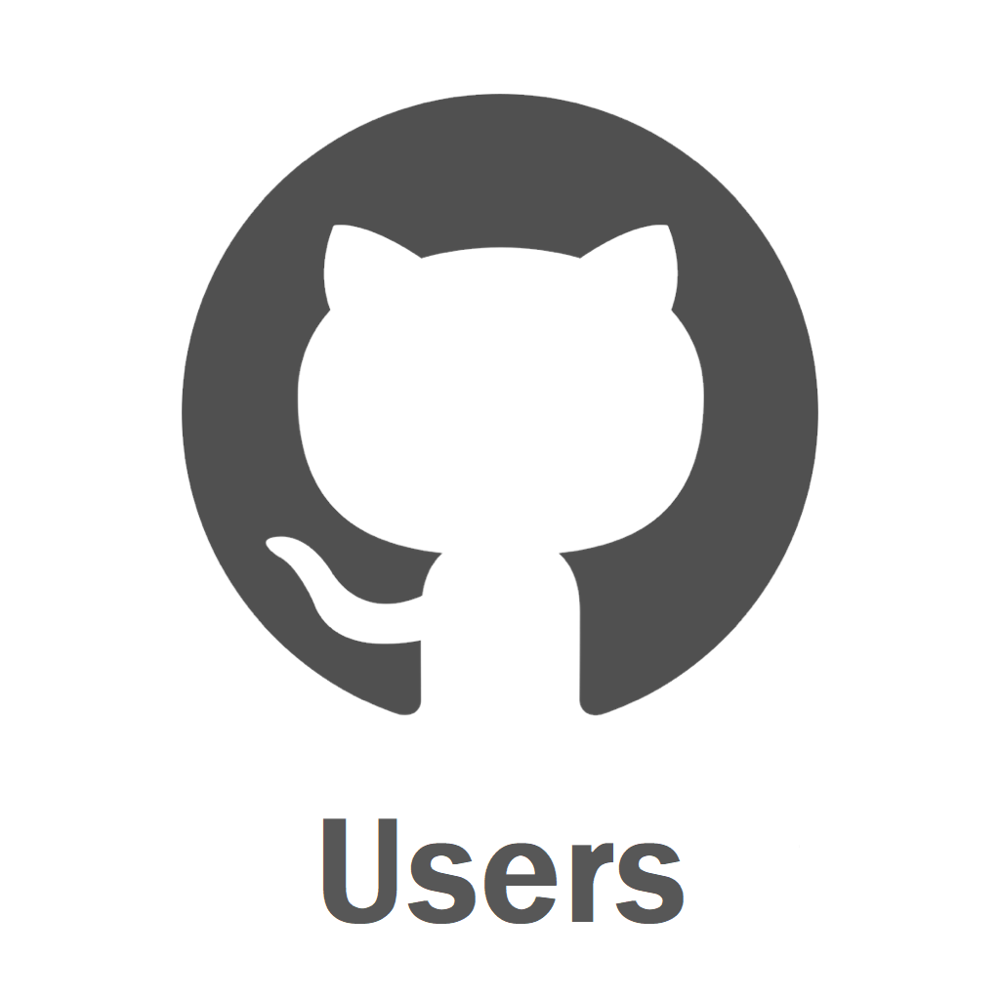
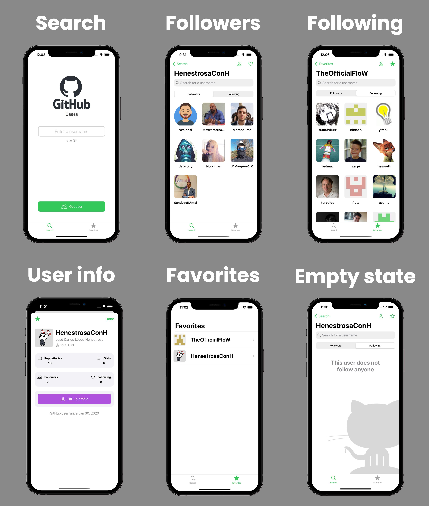
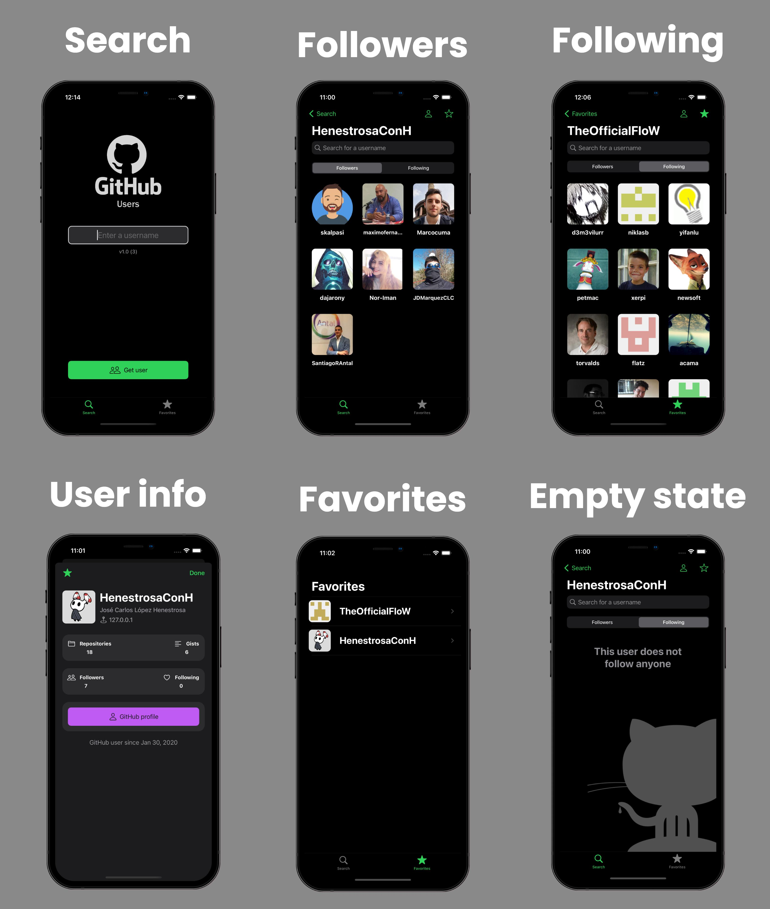
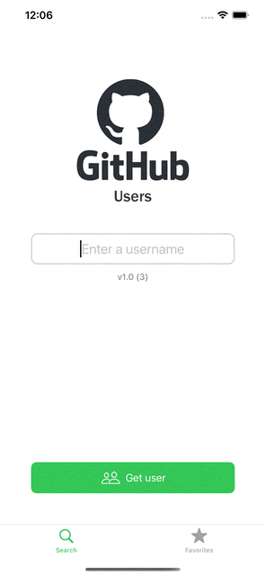
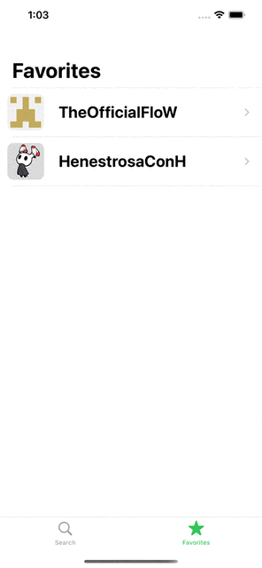
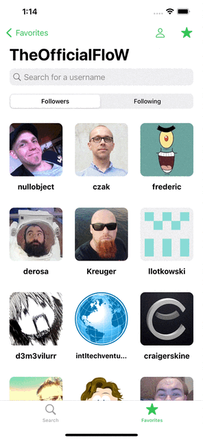

<div id="top"></div>

<!-- PROJECT SHIELDS -->
<!--
*** I'm using markdown "reference style" links for readability.
*** Reference links are enclosed in brackets [ ] instead of parentheses ( ).
*** See the bottom of this document for the declaration of the reference variables
*** for contributors-url, forks-url, etc. This is an optional, concise syntax you may use.
*** https://www.markdownguide.org/basic-syntax/#reference-style-links
-->

<!-- PROJECT LOGO -->
<br />
<div align="center">
    
    <h2 align="center">GitHub Users</h2>
    <p align="center">
        Modified "GitHub Followers" take-home project made by Sean Allen for his programmatic UIKit course that includes more features than the original.
        <br />
        <br />
        <br />
        <a href="https://github.com/HenestrosaConH/github-users/stargazers">
          
        </a>
        <a href="https://github.com/HenestrosaConH/github-users/graphs/contributors">
          
        </a>
        <a href="https://github.com/HenestrosaConH/github-users/issues">
          
        </a>
        <a href="https://github.com/HenestrosaConH/github-users/pulls">
          
        </a>
        <br />
        <br />
        <a href="https://github.com/HenestrosaConH/github-users/issues/new/choose">Report Bug</a> · <a href="https://github.com/HenestrosaConH/github-users/issues/new/choose">Request Feature</a> · <a href="https://github.com/HenestrosaConH/github-users/discussions">Ask Question</a>
    </p>
</div>

<!-- TABLE OF CONTENTS -->

## Table of Contents

- [About the Project](#about-the-project)
    - [Screen](#screens)
    - [List of Changes](#list-of-changes)
    - [Project Structure](#project-structure)
- [Getting Started](#getting-started)
- [Usage](#usage)
    - [Quick Start](#quick-start)
    - [Show User Info](#show-user-info)
    - [Add/Remove a User From Favorites](#addremove-a-user-from-favorites)
    - [Filter Users List](#filter-users-list)
- [Roadmap](#roadmap)
- [Contributing](#contributing)
- [Authors](#authors)
- [Acknowledgments](#acknowledgments)
- [Support](#support)

<!-- ABOUT THE PROJECT -->

## About the Project

The main purpose of the application is to let the app user enter a GitHub username and retrieve
a list of their followers and following. The app's user can filter the results for a specific user.

Moreover, the app user is able to tap on a follower/following to get more information about that user. We also let the user
add other users to favorites, so they don't have to type them every time. This needs to persist between app launches. 

The app is made without 3rd party libraries and the UI is 100% programmatic (no `.xib` files nor Storyboards).

The app connects to the GitHub API in order to access these endpoints:
- Followers endpoint - https://developer.github.com/v3/users/USERNAME/followers
- Following endpoint - https://developer.github.com/v3/users/USERNAME/following
- User endpoint - https://developer.github.com/v3/users/USERNAME

<!-- LIST OF CHANGES -->

### List of Changes

There might be some more subtle differences between the base project and my project, but these are the main ones:
- Edited icons to change "Followers" to "Users" in order to match the new project name.
- Moved `GFCard` group to `Components/UIView` because it didn't make any sense that the cards were UIViewControllers instead of UIViews.
- Renamed `ItemsInfoVCs` to `GFCardItem` to be more descriptive. 
- Made the necessary changes to convert the project into a pure MVC project in order to conform to SOLID principles because the base project mixed user interface's concerns with the business logic of the application.
- Restructuring of the project root groups.
- Added `MARK` to files in order to improve their organisation.
- Added `ScopeButtonsOption` to `searchController.searchBar` in `UsersList` in order to add the option to show the users that the searched user is following.
- Added `KeyboardDismissible` protocol in order to hide the keyboard when the user taps outside a focused textfield.
- Added associated properties to enums instead of using raw values.
- Added Spanish and French support.
- Added the option to favorite a user from the `UserInfo` screen.
- Changed favorite icon to a star (☆) because, if you notice, there were inconsistencies in the base project. The tab bar icon for **Favorites** was a star and, in the rest of the app, it was represented as a heart (♡). Now it is represented as a star (☆) everywhere. 
- Now you can add and remove a user from favorites from `UsersList` and `UserInfo` screens. The base project only allowed to add a user to favorites from the **UsersList** screen and remove it by sliding an item in the list from the **Favorite** screen. 
- Added `ImageHelper` to `Utils` and `ImageManager` to `Persistence` in order to store favorites' avatar image in the application support directory instead of accessing the `ImageService` each time the **Favorites** screen is accessed.
- Added `Cache` to `Utils` in order to separate the cache logic from the `ImageService` logic.
- Added user info icon to `UsersList` navigation bar. Now you can access the searched user info directly from that screen, which was not possible in the base project. 
- Refactored and improved the **network layer**. For this, a `Network` group has been added, which abstracts all networking operations.
- Added version label to `Search` screen containing the version and build number of the project.
- Improved the way to get more users when scrolling to the end of the `UICollectionView` from `UsersListVC`. Now it's done with `collectionView willDisplay` instead of `scrollViewDidEndDragging` because it felt wonky.
- All ViewControllers have been broken down into more files and classes to follow the separation of concerns principle.   

<!-- PROJECT STRUCTURE -->

### Project Structure

<details>
    <summary>ASCII folder structure</summary>
    ```
    └─ GitHubUsers
        ├── AppDelegate.swift
        ├── Base.lproj
        ├── Components
        │   ├── GFAlert
        │   │   ├── GFAlertContainerView.swift
        │   │   └── GFAlertViewController.swift
        │   ├── UIButton
        │   │   └── GFButton.swift
        │   ├── UICollectionViewCell
        │   │   └── GFFollowerCell.swift
        │   ├── UIImageView
        │   │   └── GFAvatarImageView.swift
        │   ├── UILabel
        │   │   ├── GFBodyLabel.swift
        │   │   ├── GFSecondaryTitleLabel.swift
        │   │   └── GFTitleLabel.swift
        │   ├── UITabBarController
        │   │   └── GFTabBarController.swift
        │   ├── UITableViewCell
        │   │   └── GFFavoriteCell.swift
        │   ├── UITextField
        │   │   └── GFTextField.swift
        │   └── UIView
        │       ├── GFCard
        │       │   ├── GFBaseCardView.swift
        │       │   ├── GFGitHubProfileButtonCardView.swift
        │       │   └── GFItemInfoCardView.swift
        │       ├── GFCardItem
        │       │   ├── GFBaseItem.swift
        │       │   ├── GFFollowersItem.swift
        │       │   ├── GFFollowingItem.swift
        │       │   └── GFItemInfoType.swift
        │       ├── GFEmptyStateView.swift
        │       └── GFUserInfoHeaderView.swift
        ├── Extensions
        │   ├── Bundle+Ext.swift
        │   ├── Date+Ext.swift
        │   ├── String+Ext.swift
        │   ├── UICollectionViewFlowLayout+Ext.swift
        │   ├── UIView+Ext.swift
        │   └── UIViewController+Ext.swift
        ├── Info.plist
        ├── Models
        │   ├── User.swift
        │   └── UserInfo.swift
        ├── Network
        │   ├── Base
        │   │   ├── GFNetworkError.swift
        │   │   ├── HTTPClient.swift
        │   │   └── HTTPMethod.swift
        │   ├── Endpoints
        │   │   ├── Endpoint.swift
        │   │   └── UsersEndpoint.swift
        │   └── Services
        │       ├── ImageService.swift
        │       └── UsersService.swift
        ├── Persistence
        │   ├── Base
        │   │   ├── GFPersistenceError.swift
        │   │   ├── ImageManager.swift
        │   │   └── UserDefaultsManager.swift
        │   └── Repositories
        │       ├── FavoriteRepository.swift
        │       └── Repository.swift
        ├── Protocols
        │   ├── HasCustomView.swift
        │   ├── KeyboardDismissable.swift
        │   └── Userable.swift
        ├── Resources
        │   ├── Images
        │   │   ├── Assets.xcassets
        │   │   │   ├── AccentColor.colorset
        │   │   │   ├── AppIcon.appiconset
        │   │   │   ├── Contents.json
        │   │   │   ├── avatar-placeholder.imageset
        │   │   │   ├── empty-state-logo.imageset
        │   │   │   └── gh-logo.imageset
        │   │   ├── GFImages.swift
        │   │   └── SFSymbol.swift
        │   └── Strings
        │       ├── en.lproj
        │       │   └── Localizable.strings
        │       ├── es.lproj
        │       │   └── Localizable.strings
        │       └── fr.lproj
        │           └── Localizable.strings
        ├── SceneDelegate.swift
        ├── Screens
        │   ├── FavoriteList
        │   │   ├── FavoriteListDataSource.swift
        │   │   ├── FavoriteListDelegate.swift
        │   │   ├── FavoriteListView.swift
        │   │   └── FavoriteListViewController.swift
        │   ├── Search
        │   │   ├── SearchDelegate.swift
        │   │   ├── SearchView.swift
        │   │   └── SearchViewController.swift
        │   ├── UserInfo
        │   │   ├── UserInfoDelegate.swift
        │   │   ├── UserInfoView.swift
        │   │   └── UserInfoViewController.swift
        │   └── UserList
        │       ├── UserListDataSource.swift
        │       ├── UserListDelegate.swift
        │       ├── UserListView.swift
        │       └── UserListViewController.swift
        └── Utils
            └── Cache.swift
    ```
</details>

### Screens

<details open>
    <summary>Light</summary>
    
</details>

<details>
    <summary>Dark</summary>
    
</details>


<p align="right">(<a href="#top">back to top</a>)</p>


<!-- GETTING STARTED -->

## Getting Started

1. Clone the project with the `git clone https://github.com/HenestrosaConH/github-users.git` command.
2. Open `GitHubUsers.xcodeproj` in [Xcode](https://developer.apple.com/xcode/).

<p align="right">(<a href="#top">back to top</a>)</p>

<!-- USAGE -->

## Usage

<div align="center">
    <picture>
      <source media="(prefers-color-scheme: dark)" srcset="Docs/Gifs/Dark/overview.gif">
      
    </picture>
</div>

### Quick start

The usage of the application is very straightforward and simple. However, here is a quick start guide to all the app's features:

1. First, you will need to enter a username in order to get their followers/following. To do that, you just have to tap on the 
textfield, enter the username of an existing user and tap on the **Get followers** button.
2. Once you do this, the followers of that particular user will be shown on the screen. However, if the searched user does not have any
followers, a view with the message "This user has no followers" will appear. Please bear in mind that you will have to have Internet conection
in your device in order to load the users. Otherwise, a dialog will be prompted to inform you that no users could be fetched.

### Show User Info

The `UserInfo` screen shows how many repositories, gists, followers and followings the user has.
Moreover, you can see their location, biography and joined date. You can even open their GitHub profile by tapping on the self-titled button on the screen.

To access it you can do it via these two methods in the `UsersList` screen:
  - Just tap on any user cell. That will present a new screen showing the user information with
  - Tap on the user icon in the top right corner of the screen. That will display the user info of the searched user.

### Add/Remove a User From Favorites

There are two ways to do this:
- Tap on the star (☆) icon in the `UserInfo` screen.
- Tap on the star (☆) icon in the `UsersList` screen.

Moreover, if you want to remove a user from favorites, there is an additional option. You can swipe a user cell to show and tap on the **Delete** button.

Here is a gif showing how to do this:

<details>
  <summary>Demonstration</summary>
  <div align="center">
    <picture>
      <source media="(prefers-color-scheme: dark)" srcset="Docs/Gifs/Dark/swipe-to-delete.gif">
      
    </picture>
  </div>
</details>

Once you have added a user to favorites, you can check that the user is, in fact, added by tapping on the **Favorites** button from the bottom tab bar.

### Filter Users List

You can search for a specific user among all the followers or users that the searched user is following. 
To do it, you just have to enter the username that you want to look for in the search bar.

Here is a demonstration of how to do it:

<details>
  <summary>Demonstration</summary>
  <div align="center">
    <picture>
      <source media="(prefers-color-scheme: dark)" srcset="Docs/Gifs/Dark/filter-user.gif">
      
    </picture>
  </div>
</details>

<p align="right">(<a href="#top">back to top</a>)</p>

## Roadmap

- [ ] Refactor `UserListViewController`.
- [ ] Open **Repositories** and **Gists** on `UserInfo` screen when tapping on them.
- [ ] Currently, the user can only filter by the users loaded in the app, which might not be the total amount of users to filter by. It would be nice if the app user could filter for all the followers/following users instead of filtering only by the ones that are loaded in the app's list. 
- [ ] Add tests
- [ ] Add a GitHub workflow once the tests are made in order to ensure that the functionality of the main branch code is correct.

You can propose a new feature creating an [issue](https://github.com/HenestrosaConH/github-users/new/choose).

<p align="right">(<a href="#readme-top">back to top</a>)</p>

<!-- CONTRIBUTING -->

## Contributing

Contributions are what make the open source community such an amazing place to learn, inspire, and create. Any contributions you make are **greatly appreciated**.
Please, read the [CONTRIBUTING.md](https://github.com/HenestrosaConH/github-users/blob/main/.github/CONTRIBUTING.md) file, where you can find more detailed information about how to contribute to the project.

<p align="right">(<a href="#top">back to top</a>)</p>

<!-- AUTHORS -->

## Authors

- **Mentor**: Sean Allen <[https://www.youtube.com/c/SeanAllen](https://www.youtube.com/c/SeanAllen)>
- **Repository**: HenestrosaConH <[henestrosaconh@gmail.com](henestrosaconh@gmail.com)> (José Carlos López Henestrosa)

See also the list of [contributors](https://github.com/HenestrosaConH/github-users/contributors) who participated in this project.

<p align="right">(<a href="#top">back to top</a>)</p>

<!-- ACKNOWLEDGMENTS -->

## Acknowledgments

I've made use of the following resources to make this project:

- [Best-README-Template](https://github.com/othneildrew/Best-README-Template/)
- [Sean Allen's course](https://seanallen.teachable.com/p/take-home)
- [Templated screenshots made with screenshots.pro](https://screenshots.pro/)
- [Caching in Swift](https://www.swiftbysundell.com/articles/caching-in-swift/)
- [Async/Await generic network layer](https://betterprogramming.pub/async-await-generic-network-layer-with-swift-5-5-2bdd51224ea9)

<p align="right">(<a href="#top">back to top</a>)</p>

<!-- SUPPORT -->

## Support

[](https://ko-fi.com/U7U5J6COZ)

<p align="right">(<a href="#top">back to top</a>)</p>
